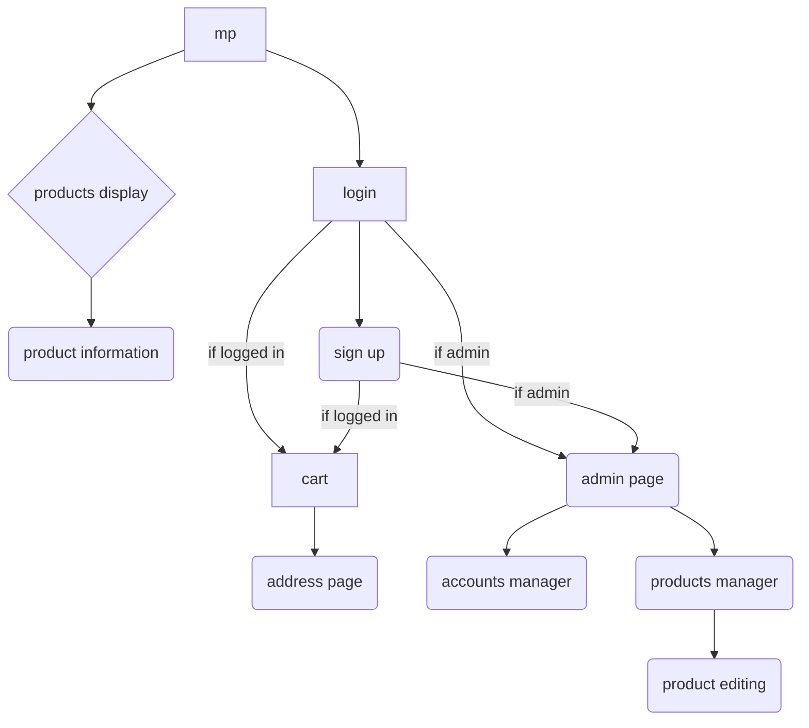
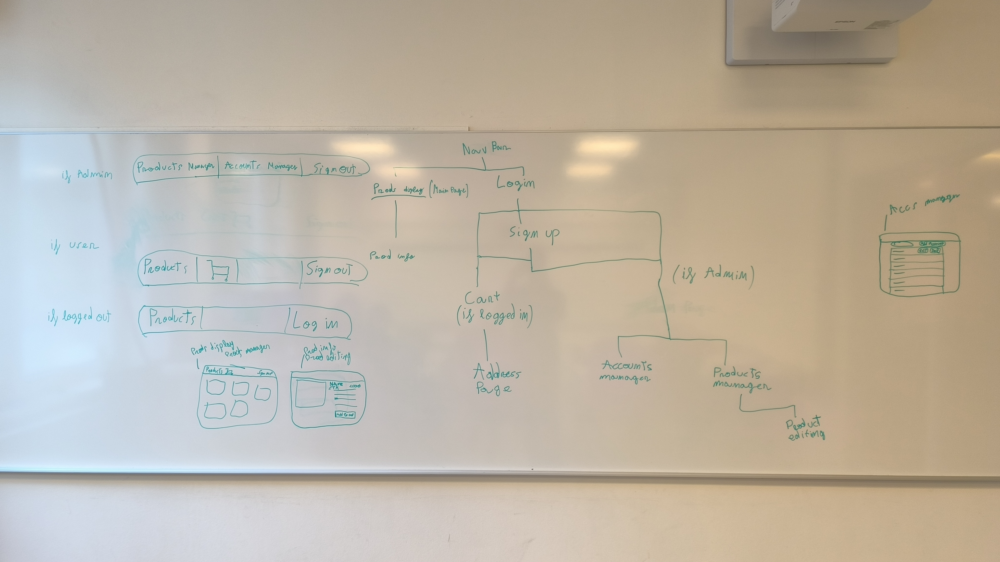

# Web design

To see the diagram in VS Code install the extension _Markdown Preview Mermaid Support_

- product display
    - search
    - grid display
        - future if we have time, choose between grid and list (with description)
- product information
    - pic
    - name
    - description
    - …
    - add to cart
- product editing
    - product information: not same page
    - no add to cart button
    - edit button
    - delete button
- account manager
    - “search bar”: email, redirects to that page count page
    - edit account button
    - all accounts display as list
- navbar
    - admin
        | products manager | accounts manager | sign out |
        | --- | --- | --- |
    - user
        
        | products | 🛒 | sign out |
        | --- | --- | --- |
    - logged out
        
        | products | log in |
        | --- | --- |
        
        cart button redirects to sign in
        
- log in page, can change to sign in